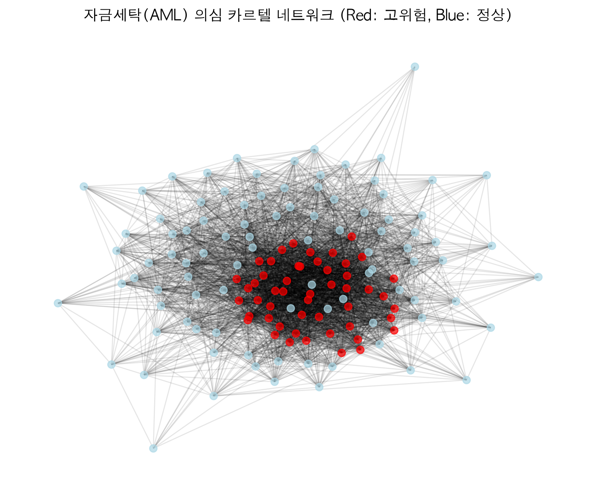
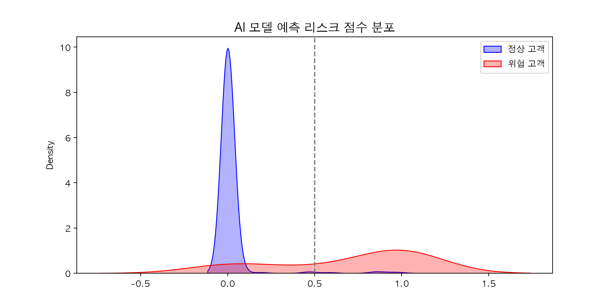
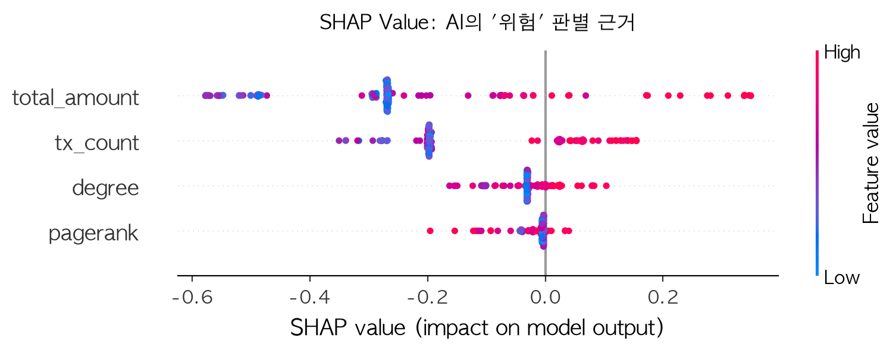
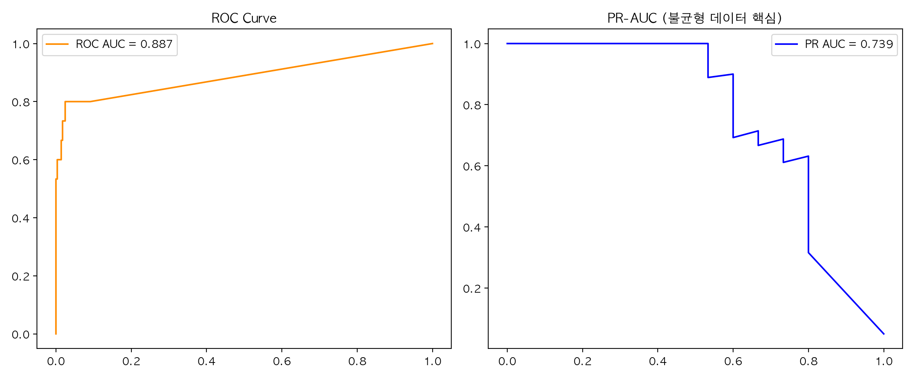
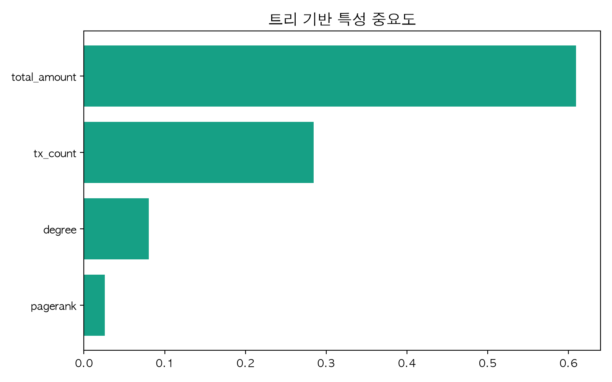

# 💳 Card AML Network Risk Scoring: Explainable AI 기반 자금세탁 방지 파이프라인

## 📌 1. 프로젝트 핵심 요약 (Executive Summary)
"전통적인 룰베이스(Rule-based) FDS가 잡아내지 못하는 교묘한 '자금세탁 카르텔'을 어떻게 선제적으로 적발할 것인가?"

금융권 FDS 실무 환경을 타겟팅하여 작성된 상용화(Production-Ready) 수준의 이상거래탐지 고도화 프로젝트입니다. 
단순 거래 금액 분석을 넘어 네트워크 토폴로지(Network Topology)와 설명가능한 인공지능(XAI)을 결합하여 실무적 난제들을 해결합니다.

---

## 📊 2. 핵심 시각화 대시보드 (Visual Analytics)

### 🕸️ 1. 은닉 자금망 카르텔 시각화 (Network Topology)
수면 아래에 숨어있는 '대포통장 중심지(Hub)'와 의심 가맹점 공유 그룹을 그래프로 렌더링하여 식별합니다.

### 🎯 2. 리스크 스코어 분포도 (Risk Score Distribution)
모델이 산출한 점수가 정상 고객과 위험 고객을 얼마나 명확히 분리(Separation)하는지 보여주는 실무 운영 핵심 지표입니다.

### 🛡️ 3. SHAP Value 기반 감사가능성 (Explainable AI)
금융당국의 '블랙박스 AI 규제(EU AI Act)'를 통과하기 위한 지표입니다. 단순 거래액보다 `pagerank`(자금 쏠림 지표)가 모델의 결정적 근거로 작용했음을 증명합니다.

### 📈 4. 불균형 데이터 방어 실력 (PR-AUC)
극단적 불균형 데이터(정상 99%, 사기 1%)에서 ROC-AUC의 착시를 배제하고 실질적인 정탐률을 증명하는 PR-AUC 곡선입니다.

### 🧠 5. 특성 중요도 (Feature Importance)

---

## ⚙️ 3. 핵심 기술 스택
- **Network Science**: NetworkX, Bipartite Graph Projection, PageRank
- **Machine Learning**: RandomForest (class_weight='balanced_subsample'), SMOTE
- **Explainable AI**: SHAP (TreeExplainer)
